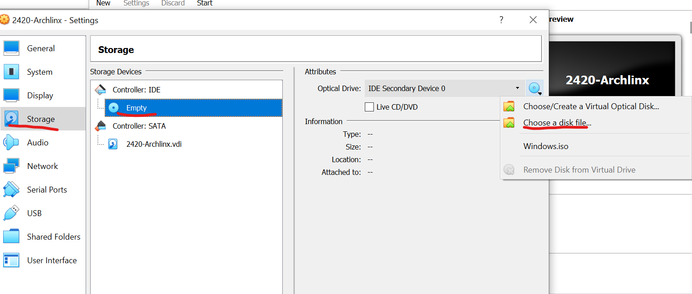
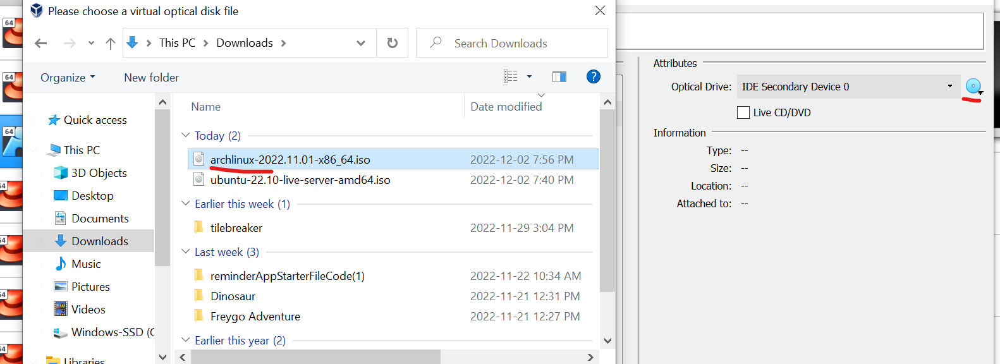
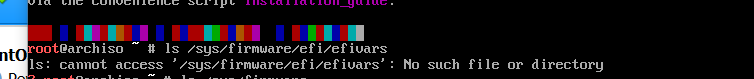
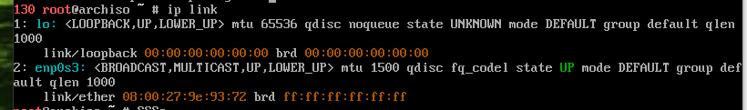
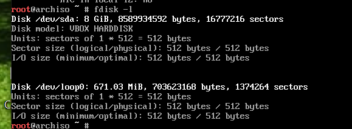

# How to install ArchLinux in Virtual Machine

## Set up
1. Download iso file from [uwaterloo link](http://mirror.csclub.uwaterloo.ca/archlinux/iso/2022.11.01/archlinux-2022.11.01-x86_64.iso)

* If the link Not working, check other files from [Arch Linux link](https://archlinux.org/download/)

2. After downloading, go to Virtual Box, and create new Virtual Machine (VM)

3. In **Storage** section, click **Empty**, then choose **Choose a disk file**
**Note** If the disk already existed, click on the disk you 'd like to use

4. Click **Oke** and then Start the virtual machine

## Pre- Installation while booting

### Step 1: Set the keyboard layout
* check the console keyboard
* Default is US
* If you want to change the keyboard, use **loadkeys** command
> eg: loadkeys de-latin1 change keyboard to German

### Step 2: Verify the boot mode
* Verify the boot mode with command
> ls /sys/firmware/efi/efivars
* If command returns error, it means that the system is not booted in UEFI mode

### Step 3: Connect to the internet
* Use command **ip link** or **ping** to check the internet connectopn

### Step 4: Update the system clock
* to make sure if the system clock is correct, use **timedatectl**
> timedatectl status

### Step 5: Partition the disks
First, check block device existed
> fdisk -l

Since we should ignore results ending in <ins>rom, loop, airoot</ins>, in this case, **/dev/sda** will be the root directory

Then, to modify partition tables, use **fdisk**
* Sample command
> fdisk /dev/the_disk_to_be_partitioned

* To modify /dev/sda, use
> fdisk /dev/sda

### STEP 6: Format partitions
* To create Ext4 file system, run
> mkfs.ext4 /dev/root_partition
> mkfs.ext4 /dev/sda

### Step 7: Mount the file systems:
* use command **mount**
> mount /dev/root_partition /mnt

> mount /dev/sda /mnt

## Installation

## STEP 1: Select mirrors
## STEP 2: install essential packages
* Use command pacstrap to install base package
> pacstrap -K /mnt base linux linux-firmware
* Tip: can substitute **linux** with **kernel**

## Configure the system

## STEP 1: generate fstab file
> genfstab -U /mnt >> /mnt/etc/fstab

## Step 2: set time zone
use command
> ln -sf /usr/share/zoneinfo/Region/City /etc/localtime

To generate /etc/adjtime, run
> hwclock --systohc

## STEP 3: working with locale file
run command
> local-gen

To create locale.conf and set LANG variable,

> /etc/locale.conf
> LANG=en_US.UTF-8

## Step 4: Network configuration
create **hostname** file

> mkdir /etc/hostname
myhostname

## Step 5: Set root password:

> passwd

After that, install **boot loader**, and enable microcode updates

